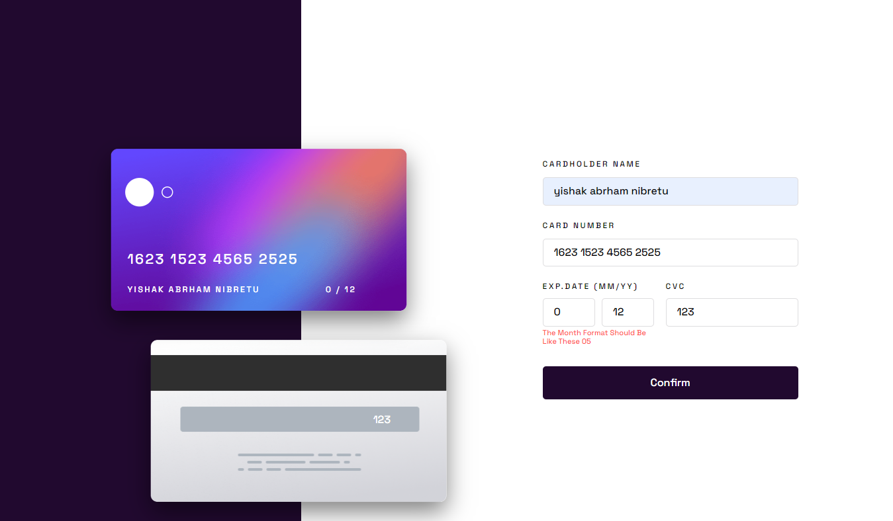

# Frontend Mentor - Interactive card details form solution

This is a solution to the [Interactive card details form challenge on Frontend Mentor](https://www.frontendmentor.io/challenges/interactive-card-details-form-XpS8cKZDWw) by Yishak Abrham.

## Table of contents

- [Overview](#overview)
  - [The challenge](#the-challenge)
  - [Screenshot](#screenshot)
  - [Links](#links)
- [My process](#my-process)
  - [Built with](#built-with)
  - [What I learned](#what-i-learned)
  - [Continued development](#continued-development)
  - [Useful resources](#useful-resources)
- [Author](#author)
- [Acknowledgments](#acknowledgments)

### The challenge

Users should be able to:

- Fill in the form and see the card details update in real-time
- Receive error messages when the form is submitted if:
  - Any input field is empty
  - The card number, expiry date, or CVC fields are in the wrong format
- View the optimal layout depending on their device's screen size
- See hover, active, and focus states for interactive elements on the page

### Screenshot



### Links

- Solution URL: [Add solution URL here](https://your-solution-url.com)
- Live Site URL: [Add live site URL here](https://your-live-site-url.com)

## My process

the process to the card design seems seasy at first but challenging in the process.
1-- the layout design
in the atm card pictures adding overlay div block element was pretty challenging specially the responsiveness part
2-- the `input type='number'` can not be limited the number of characters by `maxlength` and `max` attribute since it is not work for number type so i ended up using JS function for maxlength
3-- the input validation process was fun and at the same time pretty challenging i created several functions to check for each of them according to there input types and design.
4-- i use _moment js_ librery to validate date and month also add my function .
5-- in the scss i created a styling function for flex since it was reptitive

### Built with

- Semantic HTML5 markup
- CSS custom properties
- Flexbox
- CSS Grid
- Mobile-first workflow
- [Moment.js]() - JS library
- Javascript
- [SCSS](https://styled-components.com/) - For styles

### What I learned

these is a good practice for validate a value from inputs..
1 --**validate if all inputs have no values**
..so i grab all inputs and set them as array datas...then i use for loop to check if each of them have value inside input...`trim()` is used if space keyboard is pressed by a user and to remove it

```js
const inputs = [...document.querySelectorAll('input')];
//check input fields if one of them is empty at least..
function checkInputfields() {
  for (let i = 0; i < inputs.length; i++) {
    if (inputs[i].value.trim() === '') {
      return false; //at least one of it enough
    }
  }
  return true; //this will be true if all of them are contained with value
}
```

using this boolean data type we display error and not to pass to the next process

```js
if (checkInputfields() == false) {
  //for the card holder name
  //there is more code here

  //for the card number
  //there is more code here

  //for the month and year inputs
  if (monthInput.value == '' || yearInput.value == '') {
    dateErrorMessage.textContent = 'please fill the date and year';
    if (monthInput.value == '') {
      displayError(monthInput, dateErrorMessage);
    }
    if (yearInput.value == '') {
      displayError(yearInput, dateErrorMessage);
    }
  }
  //for the cvc input
  //there is more code here
} else if (checkInputfields() == true) {
  //if all of them contained with value
  //there is more code here
  form.classList.add('hide');
  thankYoucard.classList.add('show-thankyou');

  //redirect back to home page
  btnConfirm.addEventListener('click', (e) => {
    if (e.target.textContent.toLocaleLowerCase() == 'continue') {
      window.location.href = '/';
    }
  });
}
```

2-- **individual validation for month and year using moment.js**
using external librery and integrated with my own function i validate if the values inside month and year is valid...for example there is no month more than 12 so if the user insert value greater than 12 it display error..and also for the year

```js
function Validate(input, type, format) {
  return input.addEventListener('input', () => {
    if (moment(input.value, `${format}`, true).isValid()) {
      hideErrorText(dateErrorMessage);
      return true;
    } else {
      dateErrorMessage.textContent = `the ${type} format should be like these 05`;
      dateErrorMessage.classList.add('show');
    }
  });
}

Validate(monthInput, 'Month', 'MM');
Validate(yearInput, 'Year', 'YY');
```

3-- **checking if number input is 'number' data type only**
in the card number input only number data type required so if the user inseart another character[except space] it display error using regex validator

```js
cardNumberInput.addEventListener('keyup', function () {
  //a function[return true or false] that checks if it is number or other data type in the input using regex
  function isNumber(n) {
    return /^-?[\d.]+(?:e-?\d+)?$/.test(n);
  }
  const value = cardNumberInput.value.replace(/\s/g, ''); //to remove white spaces
  //if it is not number[false]
  if (!isNumber(value)) {
    cardErrorMessage.classList.add('show');
    setTimeout(() => {
      cardErrorMessage.classList.remove('show');
    }, 2000);
  }
});
```

finally when the user types values inside input , it display at that moment on the atm cards image

```js
const grabValue = (input, displayPlace) => {
  input.addEventListener('keyup', function () {
    const value = input.value;
    displayPlace.textContent = value;
  });
};
```

### Continued development

overlaying block element on the image with the perfect responsiveness

### Useful resources

moment.js

## Author

- Website - [Add your name here](https://www.your-site.com)
- Frontend Mentor - [@yishak621](https://www.frontendmentor.io/profile/yishak621)
- Linkdin - [@yishak](https://www.linkedin.com/in/yishak-abrham-2a865611b)

## Acknowledgments

Thank you frontend mentor for those awesome challenges!!!!!
